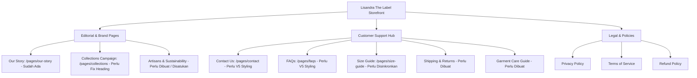

# 📋 Audit & Analisis Komprehensif: Fitur, Menu, Halaman & Integrasi Belum Selesai

**Project:** Lisandra The Label (V5 Luxury Architecture)  
**Tanggal:** 28 Agustus 2026  
**Status:** Audit Kesiapan Menuju Peluncuran Global (Pre-Launch Readiness Review)

---

## 🧭 Executive Summary

Setelah melakukan penelusuran mendalam terhadap seluruh struktur file Liquid, JSON templates, konfigurasi theme settings (`settings_data.json`), hingga integrasi third-party app embeds, kami menemukan beberapa area penting yang **belum terhubung (dead links)**, **konten placeholder yang belum diganti**, **halaman penting yang belum dibuat/distyling**, serta **potensi integrasi Shopify Apps** (Klaviyo, Reviews, Wishlist) yang perlu dioptimalkan agar toko beroperasi secara 100% profesional dan tanpa hambatan error.

---

## 🔴 1. Audit Menu & Tautan Mati (Dead-End Links)

Berikut adalah daftar menu dan tautan di seluruh website yang saat ini **tidak mengarah ke mana-mana (`#`)**, mengarah ke URL yang salah, atau berpotensi memicu error:

### A. Footer Navigation (`muse-newsletter-footer.liquid`)
| Menu / Link Text | Target URL Saat Ini | Status & Risiko | Rekomendasi Solusi |
| :--- | :--- | :--- | :--- |
| **Size Guide** | `javascript:void(0)` (`openSizeModal()`) | 🚨 **Error Kritis!** Fungsi `openSizeModal()` hanya ada di PDP. Jika diklik di Homepage/Collection/Halaman lain, konsol browser melempar `Uncaught ReferenceError`. | Ubah link menjadi `/pages/size-guide` ATAU muat modal size guide secara global di `theme.liquid`. |
| **Contact Us** | `href="#contact"` | ⚠️ Tautan mati (hanya loncat ke atas). Padahal template `page.contact.json` sudah ada. | Arahkan ke `/pages/contact`. |
| **FAQs** | `href="#faqs"` | ⚠️ Tautan mati. Padahal template `page.faqs.json` sudah ada. | Arahkan ke `/pages/faqs`. |
| **Artisans & Craft** | `href="#artisans"` | ⚠️ Tautan mati (anchor `#artisans` tidak ada di halaman mana pun). | Arahkan ke `/pages/our-story` atau buat sub-section/page khusus. |
| **Shipping & Duties** | `href="#shipping"` | ⚠️ Tautan mati. | Buat halaman `/pages/shipping-returns` atau arahkan ke accordion FAQ shipping. |
| **Returns & Exchanges**| `href="#returns"` | ⚠️ Tautan mati. | Hubungkan ke `{{ shop.refund_policy.url }}` atau `/pages/shipping-returns`. |
| **Garment Care** | `href="#care"` | ⚠️ Tautan mati. | Buat halaman `/pages/care-guide` atau buat panduan perawatan bahan Rayon & Knitwear. |
| **Stockists** | `href="#stockists"` | ⚠️ Tautan mati. | Buat halaman `/pages/stockists` (Bali Flagship / Stockists info) atau sembunyikan sementara. |

---

### B. Homepage Sections (`templates/index.json`)
| Section | Setting / Link | Masalah | Rekomendasi Solusi |
| :--- | :--- | :--- | :--- |
| **Social Feed** (`social_feed`) | `"url": "shopify://products/zaye-dress"` | ⚠️ **Salah Sasaran!** Mengklik teks handle `@lisandra.thelabel` malah membuka produk baju Zaye Dress, bukan Instagram! | Ubah link menjadi `https://instagram.com/lisandra.thelabel`. |
| **Hero Category Tiles** (`cat_sets`) | `"link": "shopify://collections/top"` | ⚠️ Mengklik tile kategori "Sets" mengarah ke koleksi "Top". | Arahkan ke koleksi `/collections/sets` atau `/collections/all`. |
| **Best Sellers Header Link** | `"link_url": ""` | ⚠️ Link "View all" di samping judul Best Sellers kosong. | Arahkan ke `/collections/best-sellers` atau `/collections/all`. |
| **Editorial Rows** (`editorial_rows`)| `"blocks": {}` | ⚠️ Section dipasang di homepage namun kosong (tanpa baris/quote), sehingga merender ruang hampa. | Tambahkan 2-3 quote editorial storytelling atau hapus jika tidak digunakan. |

---

### C. Collections Campaign Page (`templates/page.collections.json`)
| Komponen | Setting Saat Ini | Masalah | Rekomendasi Solusi |
| :--- | :--- | :--- | :--- |
| **Campaign Hero** | `"heading": "???"` | ⚠️ **Placeholder tanda tanya!** Pengunjung melihat teks `???` di atas hero image halaman koleksi. | Ganti dengan headline editorial mewah, misal: *"Woven for the Sun-Drenched"* atau *"The Resort Collection"*. |

---

## 📧 2. Audit Integrasi Email & Klaviyo

### Kondisi Saat Ini:
1. **App Embed:** Klaviyo On-Site Embed (`klaviyo-onsite-embed`) sudah aktif di `settings_data.json`.
2. **Form Newsletter Footer:** Menggunakan native form Shopify `` dengan tag `newsletter`.

### Analisis & Rekomendasi:
> [!NOTE]
> **Apakah Klaviyo saat ini sudah berfungsi?**
> **YA, secara data sinkronisasi.** Ketika pembeli memasukkan email di footer Lisandra, Shopify otomatis mencatat email tersebut sebagai *Customer (Accepts Marketing)*. Integrasi resmi Shopify-Klaviyo akan otomatis menarik data ini masuk ke list utama Klaviyo Anda.
>
> **Yang Belum Terintegrasi Maksimal:**
> 1. **Welcome Email Flow & Discount Code:** Pastikan di dashboard Klaviyo sudah dibuat *Flow Welcome Series* yang otomatis mengirimkan kupon diskon 10% saat ada subscriber baru.
> 2. **Klaviyo Back-in-Stock Alert:** Untuk varian ukuran yang *Sold Out*, saat ini tombol hanya berstatus `disabled (Sold Out)`. Jika ingin pembeli bisa memasukkan email untuk notifikasi restock otomatis, kita bisa mengaktifkan *Klaviyo Back In Stock snippet*.

---

## 📄 3. Halaman-Halaman Penting yang Belum Dibuat / Distyling

Agar brand Lisandra The Label tampil sebagai rumah mode internasional yang kredibel dan terpercaya, berikut adalah halaman-halaman yang perlu disempurnakan:

### Rincian Kebutuhan Halaman:
1. **Halaman Contact Us (`/pages/contact`):**
   - Saat ini masih menggunakan layout default tema.
   - Perlu di-*upgrade* dengan sentuhan editorial Lisandra: Info Bali Studio, WhatsApp Concierge button, Email response time (maks 24 jam), dan form kontak berlatar Paper Warm.
2. **Halaman FAQs (`/pages/faqs`):**
   - Perlu dikelompokkan berdasarkan kategori: *Sizing & Fit*, *Shipping Worldwide*, *Orders & Returns*, *Artisan Knit Care*.
3. **Halaman Shipping & Returns (`/pages/shipping-returns`):**
   - Menjelaskan gratis ongkir se-Indonesia, estimasi kurir (JNE / SiCepat / DHL Express), bea cukai internasional, dan ketentuan retur 14 hari.
4. **Halaman Garment Care (`/pages/garment-care`):**
   - Panduan merawat pakaian rajut/crochet buatan tangan: cara mencuci dengan tangan (hand wash cold), jemur mendatar (dry flat, do not hang), penyimpanan lipat.

---

## 🧩 4. Rekomendasi Shopify Apps (App Embeds Pendukung)

Untuk menaikkan level website dari sekadar etalase menjadi mesin konversi berstandar internasional, berikut adalah rekomendasi integrasi aplikasi Shopify:

| No | Kategori Fitur | Rekomendasi Aplikasi | Fungsi & Keunggulan | Status Kesiapan di Tema |
| :---: | :--- | :--- | :--- | :--- |
| **1** | **Product Reviews & UGC Stars** | **Judge.me Product Reviews** *(Gratis / Sangat Cepat)* atau **Loox** | Menampilkan bintang review di bawah judul produk PDP & badge rating di card koleksi. | Siap dipasang via App Block/Embed tanpa modifikasi kode berat. |
| **2** | **Wishlist / Save to Favorites** | **Wishlist Plus** atau **Native LocalStorage Wishlist** | Memungkinkan calon pembeli menyimpan baju idaman mereka sebelum liburan ke Bali/resort. | Bisa diintegrasikan ikon hati (`♡`) minimalis pada product card. |
| **3** | **Multi-Currency Converter** | **BUCKS Currency** *(Sudah Terpasang)* / **Shopify Markets** | Mendeteksi lokasi pengunjung dan mengonversi IDR ke USD, AUD, EUR, SGD otomatis. | Sudah aktif di `settings_data.json` & disinkronkan dengan PDP. |
| **4** | **Instagram Feed Auto-Sync** | **Instafeed** *(Sudah Terpasang)* | Menampilkan feed live Instagram di homepage. | Sudah aktif di theme, tinggal perbaiki tautan URL handle-nya. |
| **5** | **Email Marketing & Popups** | **Klaviyo** *(Sudah Terpasang)* | Mengirim welcome discount 10%, abandon cart recovery, dan VIP secret drop announcements. | App embed sudah aktif. |

---

## 🎯 5. Prioritas Tindakan (Action Roadmap)

Berikut adalah urutan langkah eksekusi yang kami rekomendasikan untuk menuntaskan seluruh celah di atas:

### ⚡ Tahap 1: Perbaikan Celah Navigasi & Tautan Mati (Quick Wins - Langsung Eksekusi)
- [ ] **Fix 1.1:** Ganti link "Size Guide" di footer agar mengarah ke `/pages/size-guide` dan aktifkan modal global agar tidak error.
- [ ] **Fix 1.2:** Hubungkan semua menu footer: `Contact Us` $\rightarrow$ `/pages/contact`, `FAQs` $\rightarrow$ `/pages/faqs`, `Artisans` $\rightarrow$ `/pages/our-story`.
- [ ] **Fix 1.3:** Perbaiki link Instagram di `templates/index.json` (dari link produk ke link IG asli).
- [ ] **Fix 1.4:** Perbaiki headline `"heading": "???"` pada `templates/page.collections.json`.
- [ ] **Fix 1.5:** Perbaiki tile kategori "Sets" di hero homepage agar tepat sasaran.

### 🎨 Tahap 2: Standardisasi Desain Halaman Statis (Luxury V5 Experience)
- [ ] **Task 2.1:** Redesign halaman `/pages/contact` dengan estetika luxury editorial V5 + WhatsApp Concierge.
- [ ] **Task 2.2:** Sempurnakan halaman `/pages/faqs` dengan accordion minimalis bertema Bodoni Moda + Cocoa.
- [ ] **Task 2.3:** Buat template halaman `/pages/shipping-returns` dan `/pages/garment-care`.

### 🚀 Tahap 3: Optimasi Fitur Lanjutan & Social Proof
- [ ] **Task 3.1:** Tambahkan placeholder App Block / Widget container untuk **Judge.me / Product Reviews** pada PDP.
- [ ] **Task 3.2:** Tambahkan opsi Wishlist / Saved Items jika diinginkan.
- [ ] **Task 3.3:** Verifikasi alur sinkronisasi Welcome Discount 10% Klaviyo.
